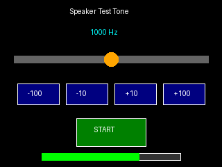

# Speaker Test Tone Generator

A comprehensive audio frequency generator tool for the **ESP32-Cheap-Yellow-Display (CYD)**.

## Features
- **Frequency Range:** 10Hz - 20kHz.
- **Controls:**
  - **Logarithmic Slider:** Smooth control across the entire audible spectrum.
  - **Fine Tune Buttons:** Precise adjustment (+/- 10Hz, +/- 100Hz).
  - **Volume Control:** Digital volume adjustment (0-127).
  - **Start/Stop:** Toggle audio output.
- **Display:** Real-time frequency readout and slider position.

## Hardware
- **Board:** ESP32-2432S028R (CYD)
- **Audio Output:** GPIO 26 (PWM via LEDC)
- **Touch Controller:** XPT2046
- **Display:** ILI9341 (320x240)

## Technical Implementation
This project implements a robust solution for the CYD's shared SPI bus issues:
- **Dual SPI Configuration:**
  - **Display:** Uses `TFT_eSPI` on the **HSPI** bus.
  - **Touch:** Uses `XPT2046_Touchscreen` on a dedicated **VSPI** instance.
- **Driver Fix:** Resolves the "duplicate func" errors common when using standard libraries on this board.

## Usage
1. **Slider:** Drag the orange knob to sweep frequencies.
2. **Buttons:** Tap to fine-tune the specific frequency you need.
3. **Start/Stop:** Toggle the tone on or off.
